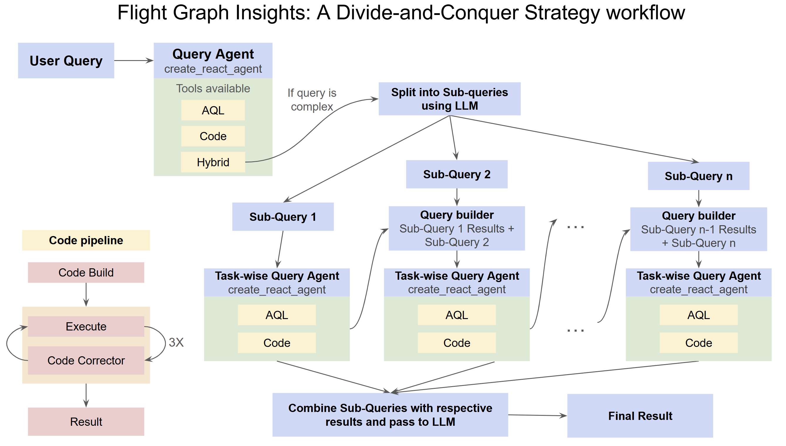
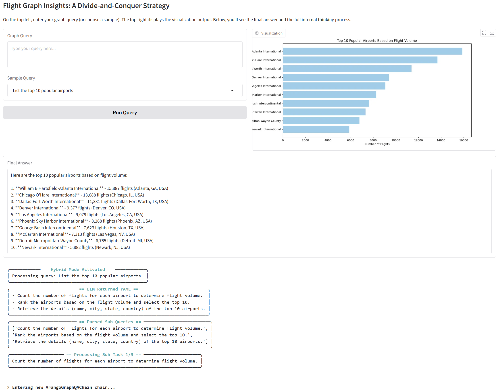

# Flight Graph Insights: A Divide-and-Conquer Strategy

This project demonstrates an end-to-end workflow for analyzing flight data as a graph using a combination of ArangoDB, NetworkX, LangChain, and LangGraph. In addition, the notebook integrates an interactive user interface using Gradio, allowing users to input natural language queries and receive both textual answers and visualizations. A CUDA-enabled version of the notebook is also available, which has been successfully run in a collaborative setting and leverages GPU acceleration for enhanced performance.


## Table of Contents

- [Overview](#overview)
- [Architecture](#architecture)
- [Installation & Setup](#installation--setup)
- [Usage](#usage)

## Overview

The project is centered on flight data represented as a graph:
- **Nodes:** Airports with metadata (e.g., location, VIP status).
- **Edges:** Flights connecting airports, including details like flight times, carriers, and distances.

The notebook covers:
- **Data Preparation:** Loading the flight dataset from ArangoDB and persisting it.
- **Graph Querying:** Two methods to answer natural language queries:
  - **Text-to-AQL Conversion:** Automatically converting natural language queries to ArangoDB Query Language (AQL) for direct database interrogation.
  - **Text-to-NetworkX Code:** Generating and executing Python code to perform graph analyses (e.g., centrality metrics, connectivity, shortest paths).
- **Hybrid Mode:** Breaking down complex queries into smaller sub-tasks, processing them, and then synthesizing a final answer.
- **Visualization:** Generating visual plots using matplotlib based on query results.
- **User Interface:** A Gradio-based UI that displays the final answer, internal logs (detailing the chain-of-thought and execution steps), and generated visualizations.
- **GPU Acceleration:** Google collab was used to run a GPU accelerated version of the notebook.
## Architecture

**Query Agent Setup:**
   - **Text-to-AQL Tool:** Converts natural language queries into AQL for direct database queries.
   - **Text-to-NetworkX Tool:** Uses language models to generate and execute NetworkX code on the materialized graph, with error correction for code execution.
   - **Hybrid Model Tool:** Decomposes complex queries into sub-tasks, executes them sequentially, and combines results into a final answer.


**Visualization Pipeline:**
   - Generate matplotlib code to visualize query results.
   - Execute the visualization code, save the resulting figure, and load it back as an image.

## Installation & Setup

1. **Clone the Repository:**

   ```bash
   git clone https://github.com/SivaTSS/flight_graph_agent.git
   cd flight-graph-insights
   ```

2. **Install Dependencies:**

   Use pip to install all required packages. For example:

   ```bash
   pip install nx-arangodb
   pip install nx-cugraph-cu12 --extra-index-url https://pypi.nvidia.com  # For CUDA-enabled GPUs only
   pip install --upgrade langchain langchain-community langchain-openai langgraph
   pip install pandas matplotlib networkx arango_datasets gradio seaborn plotly ansi2html
   ```

3. **Configure Credentials:**

   Create a `keys.json` file in the project root with the following structure:

   ```json
   {
       "arangodb_host": "http://localhost:8529",
       "arangodb_password": "your_arangodb_password",
       "openai_api_key": "your_openai_api_key"
   }
   ```

## Usage

### Running the Notebook

1. **Launch Jupyter Notebook:**

   ```bash
   jupyter notebook notebook.ipynb
   ```

### Sample Queries

- **Sample Queries:**
  - "Identify the airline operating the most flights in the dataset."
  - "Determine the airport with the highest betweenness centrality in the network."
  - "Find the most influential airports using PageRank."
  - Additional queries are provided in the notebook.

### Interactive Gradio UI

- **Interface Components:**
  - **Query Input:** Textbox for entering custom queries.
  - **Sample Query Dropdown:** Quick selection of predefined queries.
  - **Visualization Panel:** Displays plots generated from the query.
  - **Logs Panel:** Shows internal processing logs (with ANSI formatting) detailing code generation, execution attempts, and error corrections.
  - **Final Answer:** Displays the synthesized final answer.


- **Launching the UI:**
  The Gradio UI is launched from the notebook cell. Once the interface loads, users can enter queries or select a sample query and click the "Run Query" button. The UI then outputs the textual answer, logs, and visualization image.

